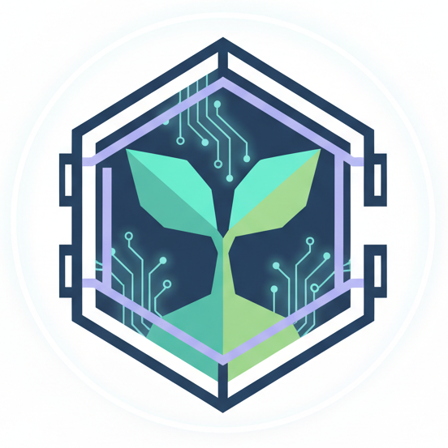

# 🌳 Sharboretum: The Care-to-Own Mini App on TON

**Developed for** TON X 42 Berlin Hackathon

**Sharboretum** is a GameFi project built as a **Telegram Mini App (TMA)** that transforms passive user effort into verifiable, unique digital assets on The Open Network (**TON**). Blending a serene, low-poly 3D aesthetic with cutting-edge blockchain technology to create a meaningful **"Care-to-Own"** experience.

## ✨ Core Innovation: Proof-of-Availability (PoA)

Solving the high-cost barrier of mass-user blockchain gaming. Instead of expensive on-chain actions, we leverage cryptography:

* **Heartbeat** $\rightarrow$ **Merkle Tree:** Every daily care action (watering/nourishing your Sharbor) is recorded as a **Heartbeat** and bundled off-chain into a single **Merkle Tree**.

* **On-Chain Proof:** Only the final **Merkle Root Hash** is committed to TON, providing **trustless, low-cost proof** of millions of users' availability and effort.

* **Verifiable Rewards:** Users use a **Merkle Proof** to claim rewards or, crucially, to **Shard** (mint new offspring NFTs).

## 🎮 Gameplay & Value Loop

The core mechanic centers on the **Sharbor NFT** (Non-Fungible Token), an asset with intrinsic value:

1. **Nurturing:** Players care for a **Shardling NFT** (seed) through daily **Heartbeats**.

2. **Lineage:** A mature Sharbor can **Shard**, minting a descendant Shardling. The Sharbor's **Lineage Length** and **Mutation Score** (influenced by social actions) are permanently recorded in the NFT metadata, driving its rarity and value.

3. **Social Virality:** Players are incentivized to **Water a Friend's Sharbor** and **Share their progress** on Telegram, boosting their Mutation Score and driving viral growth.

## 🛠️ Technology Stack (36-Hour Build)

| **Component** | **Technology** | **Role** | 
| **Frontend/UI** | **React / Framer Motion** | Stunning, fluid, mobile-first UI with subtle animations and layered controls. | 
| **3D Rendering** | **React-Three-Fiber (R3F) / Three.js** | High-performance, interactive, low-poly 3D rendering of the Sharbor model. | 
| **Backend/Logic** | **Node.js / Express / SQLite** | Off-chain management of user data, Merkle Tree construction, and Heartbeat tracking. | 
| **Blockchain** | **TON (The Open Network) / Tolk 1.1.0** | Smart Contracts for NFT (Sharbor) minting, Jetton ($SHARD$) currency, and Merkle Root verification. | 

## 🚀 Live Demo

**Open the App in Telegram:**`https://t.me/sharborkeeper_bot`
